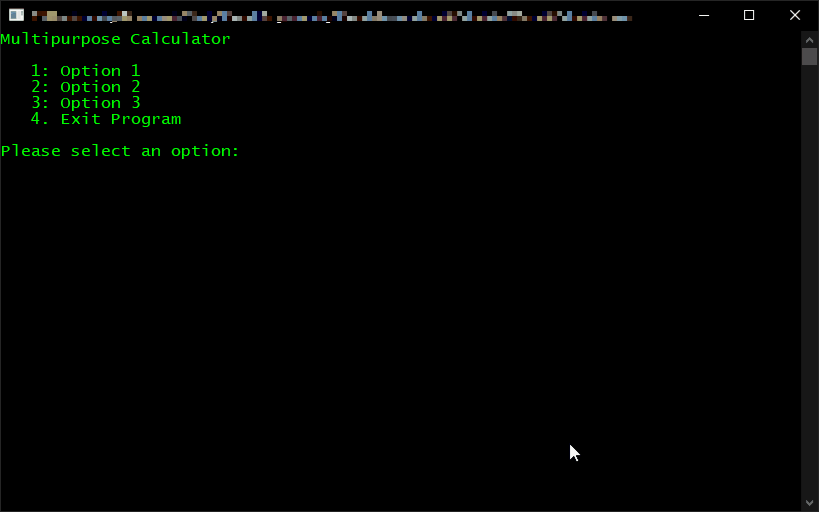

# Interactive Menu

A simple interactive text based menu that can be complied to run in the Windows command line or Linux terminal

## See It In Action

## Features

* Incorrect user input handling
* Error message response
* Screen clearing during option change
* Graceful exit of program
* Program exit confirmation
